<!-- .slide: data-background="#6A246D" -->

## Determinants

COMP1021 MCS: Linear algebra

## Previously

See the [concept diagram](https://github.com/stevenaeola/linalg_lectures/blob/7a1d5d947e3cea399d4b79471b43754e99c0f555/concepts.mmd)

Things in pink we will look at today

## Practical

Choose a question for me to go over

## Pythagoras' Theorem

William B. Faulk, [CC BY-SA 4.0](https://creativecommons.org/licenses/by-sa/4.0), via Wikimedia Commons

## Area of unit square image

The linear map $f$ on $\Bbb{R}^2$ represented by the matrix

`$$\begin{pmatrix}a & b \\ c & d\end{pmatrix}$$`

Using a graphical argument, find the area covered by the quadrilateral whose corners are

- $f((0,0))$
- $f((1,0)$
- $f((1,1))$
- $f((0,1))$

## What is a determinant?

See [3blue1brown video on determinants](https://www.youtube.com/watch?v=Ip3X9LOh2dk&list=PLZHQObOWTQDPD3MizzM2xVFitgF8hE_ab&index=6)

## Determinant of a 2x2 matrix

The determinant of a matrix $A$ is written as $det(A)$ or $|A|$

For a 2x2 matrix 

$$det(\begin{pmatrix}a & b \\ c & d\end{pmatrix}) = \begin{vmatrix}a & b \\ c & d\end{vmatrix} = ad-bc$$

The determinant is the signed area of the image of the unit square

## 2x2 examples

$$\begin{vmatrix}1 & -2 \\ 3 & -4\end{vmatrix} = 1.-4 - -2.3 = 2$$

$$\begin{vmatrix}1 & -2 \\ -2 & 4\end{vmatrix} = 1.4 - -2.-2 = 0$$

N.B. The determinant is 0 when the columns are linearly dependent

## Determinant of a $n \times n$ matrix

(Not defined for non-square matrices)

We define the determinant in terms of its properties

If a matrix $A$ is made out of columns vectors $\mathbf{c}_1,\ldots,\mathbf{c}_n$, we can define the function on the columns

$det(\mathbf{c}_1,\ldots,\mathbf{c}_n)$ with 

- linearity in each column so that 
  - $det(\mathbf{c}_1,\ldots,\mathbf{c}_n) = a.det(\mathbf{c}_1,\ldots,\mathbf{c}_n)$ 
  - $det(\mathbf{c}_1,\ldots,a\mathbf{c}_n) = a.det(\mathbf{c}_1,\ldots,\mathbf{c}_n)$
  - $det(\mathbf{c}_1 + \mathbf{c'}_1,\ldots,\mathbf{c}_n) = det(\mathbf{c}_1,\ldots,\mathbf{c}_n) + $det(\mathbf{c'}_1,\ldots,\mathbf{c}_n)$

- alternating property: if $\mathbf{c}_i = \mathbf{c}_j$ for some $i \neq j$ then $det(A)=0$
- the determinant of the identity matrix $I_n$ is 1

## Rationale based on area/volume

- Doubling one of the vectors doubles the area/volume
- We can add together the area/volumes of rectangles/cuboids/hypercuboids
- If the image of two vectors is the same then the image space has collapsed e.g. from 3D to 2D
- The unit square/cuboid/hypercuboid has area/volume 1

## Properties of determinants

- If a matrix $B$ is like $A$ but with two columns swapped then $det(B) = - det(A)$

- If a matrix $A$ has a column made up of zeros then $det(A)=0$

- If a matrix $A$ has columns that are linearly dependent then $det(A)=0$

## Determinant of diagonal matrix

`$$\begin{align}\begin{vmatrix}2&0&0\\0&4&0\\0&0&-3\end{vmatrix} &= 
2.\begin{vmatrix}1&0&0\\0&4&0\\0&0&-3\end{vmatrix} \\
&= 2.4.\begin{vmatrix}1&0&0\\0&1&0\\0&0&-3\end{vmatrix} \\
&= 2.4.-3\begin{vmatrix}1&0&0\\0&1&0\\0&0&1\end{vmatrix} \\
= -24
\end{align}
$$`

## Alternative derivation of 2x2 determinant

Expand out 

## Determinant of 3x3

Expand out? Refer to Gilbert Strang video

## Determinant of nxn

Permutation form

## Cofactors

Explanation
example in 3x3

## Transpose matrix

Definition and example

## Determinant of transpose

Equal

Can expand by any row or any column

## Combining matrices

det(AB) = det(A).det(B)

## Uses of determinants

##

Next time: inverses

